# 🏗️ ConstructTrack-SiteOps — Complete Design Document

> **Purpose**: Standalone mobile-first PWA for daily site operations — Materials, Cash, Machinery, Safety, Quality, Visitors.  
> **Relationship**: Separate app from WorkTracker, separate Supabase project, separate Railway deployment.  
> **User**: Site Engineer / Supervisor (you) — used from phone on-site.

---

## 🎨 Design Identity

| Aspect | WorkTracker | SiteOps |
|--------|------------|---------|
| **Primary Color** | Sky Blue (`sky-500`) | Emerald Green (`emerald-500`) |
| **Accent Color** | Amber (`amber-500`) | Orange (`orange-500`) |
| **Background** | Slate-950 (dark) | Zinc-950 (dark, slightly warmer) |
| **App Icon Theme** | Blueprint / Grid | Warehouse / Clipboard |
| **Typography** | Default system | **Inter** (Google Font — modern, clean) |
| **Identity** | "Inside the building" | "Running the site" |

> Both apps share the dark aesthetic but SiteOps has an **emerald/green** accent to feel visually distinct — green = operations, logistics, money.

---

## 🧱 Tech Stack (Recommended)

| Layer | Technology | Rationale |
|-------|-----------|-----------|
| **Framework** | **Next.js 14** (App Router) | Same as WorkTracker for consistency, SSR + API routes |
| **Styling** | **Tailwind CSS 3** | Rapid mobile-first UI, same as WorkTracker |
| **Database** | **New Supabase Project** | Clean isolation, separate billing, no table conflicts |
| **Language** | **TypeScript** | Type safety across the full app |
| **Hosting** | **Railway** (separate service under same project) | Simple deployment, same billing account |
| **PWA** | `next-pwa` or manual manifest | Installable on phone homescreen |
| **Image Upload** | **Supabase Storage** | Challan photos, safety incident photos, QC test photos |
| **Font** | **Inter** (Google Fonts) | Premium, modern feel |

---

## 📱 App Structure — 6 Modules via Bottom Navigation

```
┌─────────────────────────────────────────────────┐
│  ConstructTrack SiteOps          ☰  Menu        │
├─────────────────────────────────────────────────┤
│                                                 │
│           [ Active Module Content ]             │
│                                                 │
├─────────────────────────────────────────────────┤
│  📦       💰       🚜       📋       🦺       🔬  │
│ Material  Cash  Machinery Visitor Safety  QC    │
└─────────────────────────────────────────────────┘
```

---

## Module 1: 📦 Material & Inventory Management

### Screens

#### 1.1 Material Inward Register (GRN — Goods Receipt Note)
Log every material delivery at the site gate.

| Field | Type | Details |
|-------|------|---------|
| Material Category | Dropdown | Cement, Steel, Sand, Bricks, Tiles, Plumbing, Electrical, Paint, Hardware, RMC, **+ Custom** |
| Item Name | Text | "OPC 53 Grade Cement", "Fe-500D TMT 12mm" |
| Quantity Received | Number + Unit | `200 bags`, `5 tonnes`, `3 loads`, `50 boxes` |
| Quantity Ordered (PO ref) | Number | What was actually ordered (to compare) |
| Supplier / Vendor | Dropdown + Add New | "Ambuja Cement Depot", "Tata Steel Dealer" |
| Rate per Unit | Number (₹) | ₹380 / bag |
| Total Amount | Auto-calc | Qty × Rate |
| Challan Number | Text | DC-2026-0847 |
| Challan Photo | Camera/Upload | 📸 Photo of delivery challan |
| Vehicle Number | Text | MH-12-AB-1234 |
| Quality Check | Toggle | ✅ Pass / ❌ Fail + notes |
| Received By | Text / Dropdown | "Raju (Watchman)", "Suresh (Engineer)" |
| Extra Expenses | Number (₹) | Hamali, unloading charges, transport tips |
| Date & Time | Auto | Timestamped on log |

#### 1.2 Stock Ledger (Live Inventory Dashboard)
Real-time material stock on-site.

- **Card-per-material** layout showing:
  - Material name + icon
  - Current stock quantity
  - Last received date
  - Consumption rate (avg per week)
  - Low stock warning (🔴 below threshold)
- **Filter by**: Category, Date range
- **Search**: Quick search across all materials

#### 1.3 Material Issue Register
When material is issued to a contractor/floor for work.

| Field | Type |
|-------|------|
| Material | From stock dropdown |
| Quantity Issued | Number + Unit |
| Issued To | Contractor name / Floor-Wing / Purpose |
| Issued By | Engineer/Supervisor |
| Date | Auto |

> Stock = Total Inward - Total Issued - Wastage/Returns

#### 1.4 Wastage & Return Log
Track damaged/excess material returned to supplier or written off.

---

## Module 2: 💰 Petty Cash & Expense Tracker

### Screens

#### 2.1 Daily Expense Logger
Quick-entry cards for daily petty cash expenses.

| Field | Type |
|-------|------|
| Category | Dropdown: Tea/Snacks, Transport, Tools, Stationery, Phone/Recharge, Medical, Fuel, Labour Advance, Misc |
| Description | Text — "Morning tea for 12 workers" |
| Amount (₹) | Number |
| Paid To | Text — "Raju Tea Stall" |
| Payment Mode | Cash / UPI / Bank Transfer |
| Receipt Photo | Camera (optional) |
| Date | Auto |

#### 2.2 Weekly/Monthly Expense Summary
- Bar chart of expenses by category
- Total spent this week / month
- Top expense categories pie chart
- Exportable as PDF / Excel

#### 2.3 Fund Requisition Log
When you request funds from the office/owner.
- Amount requested, Date, Purpose, Status (Pending / Approved / Received)

---

## Module 3: 🚜 Machinery & Equipment Log

### Screens

#### 3.1 Equipment Register
Master list of all machinery on-site.

| Field | Type |
|-------|------|
| Equipment Type | Dropdown: JCB, Crane, Mixer, Lift, Scaffold, Bar Bender, Vibrator, Generator, Welder, Pump, **+ Custom** |
| Equipment Name / ID | Text — "JCB-01 (Yellow Escort)" |
| Owned or Rented | Toggle |
| Rental Company | Text (if rented) |
| Daily/Hourly Rate (₹) | Number (if rented) |
| Operator Name | Text |
| Start Date on Site | Date |
| Status | Active / Idle / Under Repair / Removed |

#### 3.2 Daily Usage Log
Daily entry per equipment.

| Field | Type |
|-------|------|
| Equipment | From register |
| Date | Auto |
| Hours Operated | Number |
| Fuel Consumed (liters) | Number |
| Work Done | Text — "Basement excavation, North side" |
| Operator | Text |
| Breakdown / Issue | Text (if any) |

#### 3.3 Rental Billing Calculator
- Auto-calculates: Days on site × Daily rate = Amount due
- Track payments made vs. amount due
- Alert for overdue rental payments

#### 3.4 Maintenance Schedule
- Preventive maintenance reminders
- Service history log

---

## Module 4: 📋 Visitor & Meeting Log

### Screens

#### 4.1 Visitor Entry Register

| Field | Type |
|-------|------|
| Visitor Name | Text |
| Company / Role | Text — "XYZ Architects", "Flat Owner - 301" |
| Purpose | Dropdown: Site Inspection, Client Visit, Vendor Meeting, Government Inspector, Consultant, Other |
| Entry Time | Auto |
| Exit Time | Manual |
| Photo | Camera (optional — visitor badge photo) |
| Accompanied By | Text — "Rohit Sir" |
| Notes | Text — observations, decisions taken |

#### 4.2 Meeting Minutes Log

| Field | Type |
|-------|------|
| Meeting Title | Text — "Weekly Coordination Meeting #14" |
| Date & Time | Auto |
| Attendees | Multi-text — names of people present |
| Agenda | Text |
| Decisions Taken | Bullet list |
| Action Items | Checklist — task, assigned to, deadline |
| Photos | Multiple camera uploads |

#### 4.3 Site Photo Timeline
Chronological photo diary of site progress — milestone shots, drone views, before/after.

---

## Module 5: 🦺 Safety & Compliance

### Screens

#### 5.1 Daily Safety Checklist
Morning inspection checklist.

| Check Item | Type |
|------------|------|
| All workers wearing helmets | ✅/❌ |
| Safety boots worn | ✅/❌ |
| Scaffolding secured & inspected | ✅/❌ |
| Fire extinguishers accessible | ✅/❌ |
| First aid kit available | ✅/❌ |
| Fall protection on open edges | ✅/❌ |
| Electrical connections safe | ✅/❌ |
| Housekeeping / debris cleared | ✅/❌ |
| Safety nets installed (floors >2) | ✅/❌ |
| Drinking water available | ✅/❌ |
| **Custom items** | ✅/❌ |

- Overall Safety Score: X/10
- Non-compliant items flagged with photos

#### 5.2 Incident / Accident Register

| Field | Type |
|-------|------|
| Date & Time | Auto |
| Severity | Minor / Major / Fatal / Near-Miss |
| Injured Person | Name, Age, Contractor |
| Description | Text |
| Body Part Injured | Text |
| First Aid Given | Toggle + description |
| Hospital Visit Required | Toggle |
| Photos | Camera |
| Corrective Action | Text |
| Reported To | Text — Labour Officer / BOCW |

#### 5.3 PPE Issuance Log
Track helmets, boots, harness issued to workers.

---

## Module 6: 🔬 Quality Control & Testing

### Screens

#### 6.1 Concrete Cube Test Register

| Field | Type |
|-------|------|
| Casting Date | Date |
| Grade | M20 / M25 / M30 / M35 / M40 |
| Location | "Column C4, Floor 3" |
| No. of Cubes | Number (typically 6) |
| 7-Day Result (N/mm²) | Number |
| 28-Day Result (N/mm²) | Number |
| Status | Pass (≥ required strength) / Fail |
| Lab Name | Text |
| Report Photo | Camera |

#### 6.2 Material Test Log

| Field | Type |
|-------|------|
| Material | Steel, Bricks, Tiles, Sand, Cement, etc. |
| Test Type | Tensile, Crushing, Sieve, Adhesion, etc. |
| Sample Source | "Batch received on 10-Aug" |
| Test Result | Number + unit |
| Pass / Fail | Based on IS code limits |
| Certificate Photo | Camera |

#### 6.3 Non-Conformance Report (NCR)
When work doesn't meet quality standards.

| Field | Type |
|-------|------|
| Location | Wing, Floor, Flat, Room |
| Description | What went wrong |
| IS Code Reference | Text |
| Photos | Camera |
| Assigned To | Contractor to fix |
| Status | Open → In Rectification → Closed |
| Rectification Photo | Camera |

---

## 🗄️ Database Schema (New Supabase Project)

### Core Tables

```sql
-- 1. Suppliers / Vendors
CREATE TABLE suppliers (
    id SERIAL PRIMARY KEY,
    name VARCHAR(150) NOT NULL,
    contact_person VARCHAR(100),
    phone VARCHAR(30),
    email VARCHAR(100),
    material_categories TEXT[],  -- ['CEMENT', 'SAND']
    gst_number VARCHAR(20),
    address TEXT,
    status VARCHAR(20) DEFAULT 'ACTIVE',
    created_at TIMESTAMPTZ DEFAULT NOW()
);

-- 2. Material Categories (extensible master)
CREATE TABLE material_categories (
    id SERIAL PRIMARY KEY,
    name VARCHAR(100) NOT NULL,           -- 'Cement'
    code VARCHAR(30) UNIQUE NOT NULL,     -- 'CEMENT'
    default_unit VARCHAR(20) NOT NULL,    -- 'BAGS'
    icon_name VARCHAR(50),
    low_stock_threshold NUMERIC(10,2)     -- Alert when stock drops below
);

-- 3. Material Inward Register (GRN)
CREATE TABLE material_inward (
    id SERIAL PRIMARY KEY,
    material_category_id INT REFERENCES material_categories(id),
    item_name VARCHAR(200) NOT NULL,
    supplier_id INT REFERENCES suppliers(id),
    quantity_received NUMERIC(12,2) NOT NULL,
    quantity_ordered NUMERIC(12,2),
    unit VARCHAR(20) NOT NULL,
    rate_per_unit NUMERIC(10,2),
    total_amount NUMERIC(12,2),
    challan_number VARCHAR(50),
    challan_photo_url TEXT,
    vehicle_number VARCHAR(30),
    quality_check_passed BOOLEAN DEFAULT TRUE,
    quality_notes TEXT,
    received_by VARCHAR(100),
    extra_expenses NUMERIC(10,2) DEFAULT 0,
    extra_expenses_description TEXT,
    date_received TIMESTAMPTZ DEFAULT NOW(),
    created_at TIMESTAMPTZ DEFAULT NOW()
);

-- 4. Material Issue Register
CREATE TABLE material_issued (
    id SERIAL PRIMARY KEY,
    material_category_id INT REFERENCES material_categories(id),
    item_name VARCHAR(200),
    quantity_issued NUMERIC(12,2) NOT NULL,
    unit VARCHAR(20) NOT NULL,
    issued_to VARCHAR(200),          -- contractor name / floor / purpose
    issued_by VARCHAR(100),
    date_issued TIMESTAMPTZ DEFAULT NOW()
);

-- 5. Material Wastage / Returns
CREATE TABLE material_wastage (
    id SERIAL PRIMARY KEY,
    material_category_id INT REFERENCES material_categories(id),
    item_name VARCHAR(200),
    quantity NUMERIC(12,2) NOT NULL,
    unit VARCHAR(20),
    reason VARCHAR(50),  -- 'DAMAGED', 'RETURNED_TO_SUPPLIER', 'EXCESS', 'THEFT'
    notes TEXT,
    date_logged TIMESTAMPTZ DEFAULT NOW()
);

-- 6. Petty Cash Expenses
CREATE TABLE expenses (
    id SERIAL PRIMARY KEY,
    category VARCHAR(50) NOT NULL,
    description TEXT,
    amount NUMERIC(10,2) NOT NULL,
    paid_to VARCHAR(100),
    payment_mode VARCHAR(20) DEFAULT 'CASH',
    receipt_photo_url TEXT,
    date_logged DATE DEFAULT CURRENT_DATE,
    created_at TIMESTAMPTZ DEFAULT NOW()
);

-- 7. Fund Requisitions
CREATE TABLE fund_requisitions (
    id SERIAL PRIMARY KEY,
    amount_requested NUMERIC(12,2) NOT NULL,
    purpose TEXT,
    status VARCHAR(20) DEFAULT 'PENDING',  -- PENDING, APPROVED, RECEIVED
    amount_received NUMERIC(12,2),
    date_requested DATE DEFAULT CURRENT_DATE,
    date_received DATE,
    created_at TIMESTAMPTZ DEFAULT NOW()
);

-- 8. Equipment Register
CREATE TABLE equipment (
    id SERIAL PRIMARY KEY,
    equipment_type VARCHAR(50) NOT NULL,
    name VARCHAR(150) NOT NULL,
    is_rented BOOLEAN DEFAULT TRUE,
    rental_company VARCHAR(150),
    daily_rate NUMERIC(10,2),
    hourly_rate NUMERIC(10,2),
    operator_name VARCHAR(100),
    start_date DATE,
    status VARCHAR(20) DEFAULT 'ACTIVE',
    created_at TIMESTAMPTZ DEFAULT NOW()
);

-- 9. Equipment Daily Usage Log
CREATE TABLE equipment_usage (
    id SERIAL PRIMARY KEY,
    equipment_id INT REFERENCES equipment(id) ON DELETE CASCADE,
    date_logged DATE DEFAULT CURRENT_DATE,
    hours_operated NUMERIC(5,2),
    fuel_liters NUMERIC(8,2),
    work_description TEXT,
    operator VARCHAR(100),
    breakdown_notes TEXT,
    created_at TIMESTAMPTZ DEFAULT NOW(),
    UNIQUE(equipment_id, date_logged)
);

-- 10. Equipment Rental Payments
CREATE TABLE equipment_payments (
    id SERIAL PRIMARY KEY,
    equipment_id INT REFERENCES equipment(id),
    amount_paid NUMERIC(12,2),
    payment_date DATE,
    payment_mode VARCHAR(20),
    receipt_photo_url TEXT,
    notes TEXT
);

-- 11. Visitor Log
CREATE TABLE visitors (
    id SERIAL PRIMARY KEY,
    visitor_name VARCHAR(150) NOT NULL,
    company_role VARCHAR(200),
    purpose VARCHAR(50),
    entry_time TIMESTAMPTZ DEFAULT NOW(),
    exit_time TIMESTAMPTZ,
    accompanied_by VARCHAR(100),
    photo_url TEXT,
    notes TEXT
);

-- 12. Meeting Minutes
CREATE TABLE meetings (
    id SERIAL PRIMARY KEY,
    title VARCHAR(200) NOT NULL,
    meeting_date TIMESTAMPTZ DEFAULT NOW(),
    attendees TEXT[],
    agenda TEXT,
    decisions TEXT,
    action_items JSONB,  -- [{task, assignedTo, deadline, done}]
    photos TEXT[],
    created_at TIMESTAMPTZ DEFAULT NOW()
);

-- 13. Site Photos Timeline
CREATE TABLE site_photos (
    id SERIAL PRIMARY KEY,
    caption VARCHAR(200),
    photo_url TEXT NOT NULL,
    category VARCHAR(50),  -- 'MILESTONE', 'PROGRESS', 'DRONE', 'BEFORE_AFTER'
    date_taken TIMESTAMPTZ DEFAULT NOW()
);

-- 14. Daily Safety Checklist
CREATE TABLE safety_checklists (
    id SERIAL PRIMARY KEY,
    date_logged DATE DEFAULT CURRENT_DATE UNIQUE,
    checks JSONB NOT NULL,  -- [{item, passed, notes, photoUrl}]
    overall_score INT,      -- X out of total
    inspector_name VARCHAR(100),
    created_at TIMESTAMPTZ DEFAULT NOW()
);

-- 15. Incident Register
CREATE TABLE safety_incidents (
    id SERIAL PRIMARY KEY,
    date_time TIMESTAMPTZ DEFAULT NOW(),
    severity VARCHAR(20),  -- MINOR, MAJOR, FATAL, NEAR_MISS
    injured_person VARCHAR(100),
    injured_age INT,
    contractor_name VARCHAR(100),
    description TEXT,
    body_part VARCHAR(100),
    first_aid_given BOOLEAN DEFAULT FALSE,
    first_aid_description TEXT,
    hospital_required BOOLEAN DEFAULT FALSE,
    photos TEXT[],
    corrective_action TEXT,
    reported_to VARCHAR(100),
    status VARCHAR(20) DEFAULT 'OPEN'
);

-- 16. PPE Issuance
CREATE TABLE ppe_issuance (
    id SERIAL PRIMARY KEY,
    worker_name VARCHAR(100),
    contractor_name VARCHAR(100),
    item VARCHAR(50),  -- HELMET, BOOTS, HARNESS, GLOVES, VEST
    quantity INT DEFAULT 1,
    date_issued DATE DEFAULT CURRENT_DATE,
    returned BOOLEAN DEFAULT FALSE,
    date_returned DATE
);

-- 17. Concrete Cube Tests
CREATE TABLE cube_tests (
    id SERIAL PRIMARY KEY,
    casting_date DATE NOT NULL,
    grade VARCHAR(10),  -- M20, M25, M30
    location VARCHAR(200),
    num_cubes INT DEFAULT 6,
    result_7day NUMERIC(8,2),
    result_28day NUMERIC(8,2),
    status VARCHAR(10),  -- PASS, FAIL, PENDING
    lab_name VARCHAR(100),
    report_photo_url TEXT,
    created_at TIMESTAMPTZ DEFAULT NOW()
);

-- 18. Material Test Log
CREATE TABLE material_tests (
    id SERIAL PRIMARY KEY,
    material VARCHAR(100),
    test_type VARCHAR(100),
    sample_source VARCHAR(200),
    test_result VARCHAR(100),
    pass_fail VARCHAR(10),
    certificate_photo_url TEXT,
    date_tested DATE DEFAULT CURRENT_DATE
);

-- 19. Non-Conformance Reports (NCR)
CREATE TABLE ncr_reports (
    id SERIAL PRIMARY KEY,
    location VARCHAR(200),
    description TEXT,
    is_code_reference VARCHAR(50),
    photos TEXT[],
    assigned_to VARCHAR(100),
    status VARCHAR(30) DEFAULT 'OPEN',
    rectification_photo_url TEXT,
    created_at TIMESTAMPTZ DEFAULT NOW(),
    closed_at TIMESTAMPTZ
);

-- 20. Admin / Auth
CREATE TABLE app_users (
    id SERIAL PRIMARY KEY,
    username VARCHAR(50) UNIQUE NOT NULL,
    password_hash VARCHAR(100) NOT NULL,
    name VARCHAR(100),
    role VARCHAR(20) DEFAULT 'engineer',
    phone VARCHAR(30),
    created_at TIMESTAMPTZ DEFAULT NOW()
);
```

---

## 📱 Navigation Flow

```mermaid
graph TD
    A["🏠 Home Dashboard"] --> B["📦 Material"]
    A --> C["💰 Cash"]
    A --> D["🚜 Machinery"]
    A --> E["📋 Visitor"]
    A --> F["🦺 Safety"]
    A --> G["🔬 Quality"]
    
    B --> B1["Inward Register"]
    B --> B2["Stock Ledger"]
    B --> B3["Issue Register"]
    B --> B4["Wastage Log"]
    
    C --> C1["Daily Expenses"]
    C --> C2["Summary / Reports"]
    C --> C3["Fund Requisition"]
    
    D --> D1["Equipment Register"]
    D --> D2["Daily Usage Log"]
    D --> D3["Rental Billing"]
    
    E --> E1["Visitor Entry"]
    E --> E2["Meeting Minutes"]
    E --> E3["Photo Timeline"]
    
    F --> F1["Daily Checklist"]
    F --> F2["Incident Register"]
    F --> F3["PPE Log"]
    
    G --> G1["Cube Test Register"]
    G --> G2["Material Test Log"]
    G --> G3["NCR Reports"]
```



---

## 🏠 Home Dashboard (Landing Page)

A quick-glance overview showing:

| Card | Data |
|------|------|
| 📦 **Materials** | 3 items below stock threshold 🔴 |
| 💰 **Today's Spend** | ₹4,250 across 6 entries |
| 🚜 **Active Equipment** | 5 machines running, 2 idle |
| 📋 **Visitors Today** | 3 checked in, 1 still on-site |
| 🦺 **Safety Score** | Today: 8/10 ✅ |
| 🔬 **Pending Tests** | 2 cube tests awaiting 28-day results |

---

## 🚀 Deployment Strategy

| Item | Detail |
|------|--------|
| **Supabase** | New project (separate from WorkTracker) |
| **Railway** | New service under the same `ConstructTrack` Railway project |
| **Domain** | `siteops-production.up.railway.app` (Railway-generated) |
| **PWA** | Installable from mobile browser, homescreen icon |
| **Storage** | Supabase Storage buckets for challan photos, safety photos, test certificates |

---

## Open Questions

> [!IMPORTANT]
> Please confirm these before I start building:

1. **Supabase credentials** — Should I create the new Supabase project for you, or will you provide the URL + anon key?
2. **Any additional material categories** beyond the 10 listed? (You mentioned "May be more products in future" — the system is fully extensible with a master table)
3. **Do you want data export** (PDF/Excel) for any module from day 1? (e.g., Monthly material consumption report, expense statement)
4. **Shall I start building now?** All 6 modules in one go as you requested?
